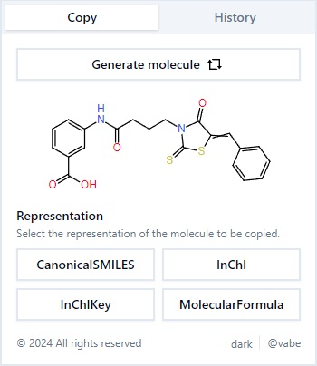
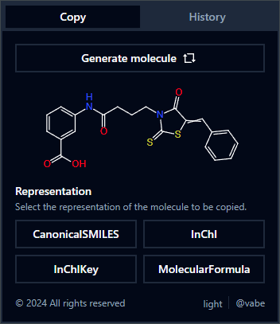

# Chimie

Light-weight browser extension to copy random molecule data from trusted sources that can be used by scientists and enthusiasts alike.

|  |  |
| :-------------------------------------------------: | :-----------------------------------------------: |
|                    Chimie light                     |                    Chimie Dark                    |

## ⚙️ Getting started

The project requires that you have [Node](https://nodejs.org/en) running on your machine. It has been tested using `v20.9.0`.

### ⏳ Installation

First, install the dependencies:

```bash
npm i
```

Then run build the project:

```bash
npm run build
```

This generates an output into the `./build` folder. Using your Chromium-based browser (support might be coming to other browsers later on), navigate to the Extension management page, turn on Developer mode and click on "Load unpacked". Navigate to the location of this project on your disk, select the `./build` folder then click "Select Folder".

If everything went smoothly, you should see the extension listed in your Installed Extensions section.

> 💡 For ease of use, it's recommended to pin the extension to your toolbar so you can click on it without navigating anywhere.

### Development

If you want to tailor the project to your needs, you can either:

1. `npm run dev`
   - run the project as a standalone svelte project in your browser
   - this option is great if you just need style changes as the updates can be applied almost instantenosly on localhost
2. `npm run dev:ext`
   - run the build in watch mode
   - this option allows you to work on the extension directly

## 🏗️ Structure

The overall structure can be seen in the tree representation below, and can be broken down into the following sections.

```
.
└── chimie/
    ├── build/                      # output directory, used for install
    ├── src/
    │   ├── lib/
    │   │   ├── components/
    │   │   │   ├── ui/             # shadcn components
    │   │   │   ├── spinner.svelte
    │   │   │   └── ...
    │   │   ├── storage-handler.ts  # custom helpers
    │   │   └── ...
    │   ├── routes/                 # file system-based routing
    │   │   ├── +page.svelte
    │   │   └── +layout.svelte
    │   └── utils/
    │       ├── constants.js
    │       └── ...
    ├── static/
    └── ...
```

## 📚 Learn more

[SvelteKit](https://kit.svelte.dev/) fast, fun and flexible love letter to web development. In other words, a framework built on Svelte and provides additional features like SSR, filesystem-based routing, preloading, API routes, and many more. And it makes writing extensions surprisingly easy.

[SMILES Language](https://www.daylight.com/dayhtml/doc/theory/theory.smiles.html) is a line notation for entering and representing molecules and reactions. [InChI](https://www.ncbi.nlm.nih.gov/pmc/articles/PMC4486400/) is the International Chemical Identifier. A chemical identifier is a text label that denotes a chemical substancea. These labels are of the utmost importance as they provide a convenient means of comparing and distinguishing chemicals in a variety of applications, from the design of new materials to legal and regulatory issues.

[PubChem](https://pubchem.ncbi.nlm.nih.gov/) the world's largest collection of freely accessible chemical information. Their API is used for querying molecules based on a randomly generated ID.
